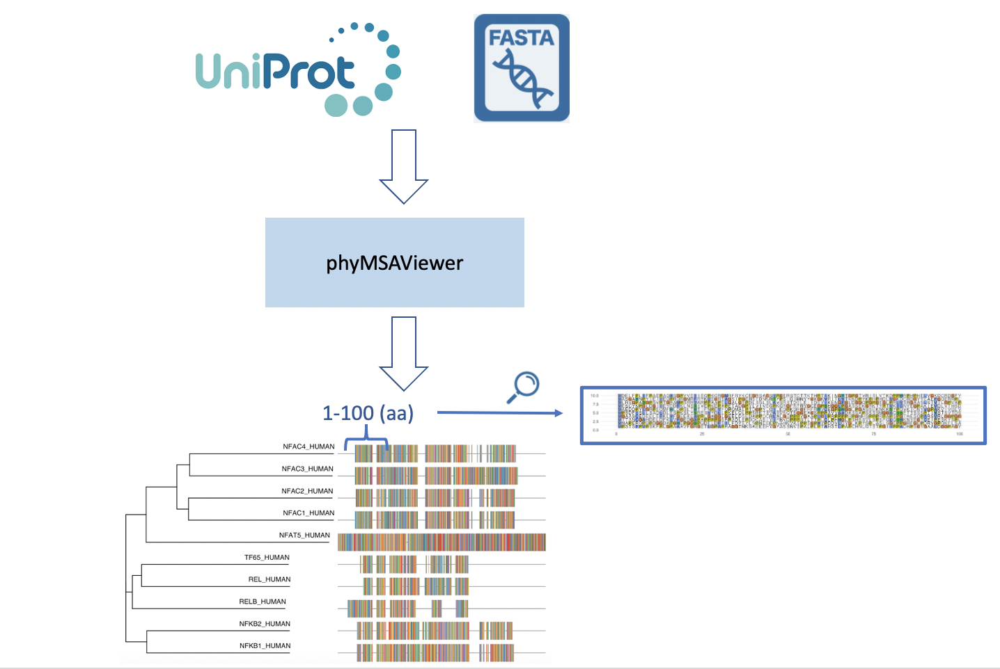

<!-- README.md is generated from README.Rmd. Please edit that file -->

```{r, include = FALSE}
knitr::opts_chunk$set(
  collapse = TRUE,
  comment = "#>",
  fig.path = "man/figures/README-",
  out.width = "100%"
)
```

# phyMSAViewer 

<!-- badges: start -->
<!-- badges: end -->

## Description
The goal of phyMSAViewer is to provide a general overview of a phylogenetic tree with its multiple sequence alignment on the side. The users can either provide a sequence alignment file in fasta or can just type in the Uniprot IDs manually to get the results. Another unique function is that the users are able to zoom on a particular range of the multiple sequence alignment from the R ShinyApp.

## Installation

You can install the released version of phyMSAViewer from GitHub with:

``` r
library(devtools)
devtools::install_github("helen307/phyMSAViewer", build_vignettes=TRUE)
library(phyMSAViewer)
```

## Example

This is a basic example which shows you how to get a phylogenetic graph with MSA from the Uniprot ID entered:

``` r
library(phyMSAViewer)
treeWithMSA <- uniprotToPhy("AC=P19838 OR AC=Q00653 OR AC=Q01201")
treeWithMSA
```

## Overview

``` r
ls("package:phyMSAViewer")
data(package="phyMSAViewer")
browseVignettes("phyMSAViewer")
shiny::runApp(appDir = system.file("phyMSAViewerShinyApp", package = "phyMSAViewer"),)
```

There are mainly two functions in this package, including producing phylogenetic trees and multiple sequence alignment from Uniprot IDs and from fasta files. A sample dataset `mySeqs` is provided, and we will require a file of the same format as input to `seqToPhy`. For `uniproToPhy`, please provide a correct character string, separated by " OR " and led by "AC=". The function will also perform a check on the user input, please ensure you type accurate Uniprot IDs.

Users can also access the `uniprotToPhy` function through the **ShinyApp** (the fourth command indicated above). This Shiny App will also allow users to view the amino-acids' differences between MSA by selecting the window size. Please be patient with the Shiny App as the running time depends on the number of Uniprot ID of input.

An overview of the phyMSAViewerer package is shown below:

## Progress since the initial submission
(Will delete after being graded)
* Added checkpoints for user input Uniprot IDs.
* Added tests directory.
* Fixed installation problem.
* Added ShinyApp (moved to the inst subdirectory).
* Fixed vignette knit problem.
* Allow input greater than 3 uniprot IDs.
* Added full references to data and all R files, italicize all the journal titles.
* Added README.Rmd file, used it to generate README.md file.
* Filled in DESCRIPTION file.


## Contributions
The author of the package is Yining Ding. seqinr was used to retrieve sequence data from the Uniprot database. The uniprotToPhy function makes use of msaplot from ggtree package to generate the phylogenetic tree with multiple sequence alignment. The msa R package is used for performing MUSCLE multiple sequence alignment. The R shiny package was used to produce the Shiny App.


## References
1. Charif, D., Lobry, J. R., Necsulea, A., Palmeira, L., Penel, S., Perriere, G., & Penel, M. S. (2020). Package ‘seqinr’.
2. Edgar, R. C. (2004). MUSCLE: multiple sequence alignment with high accuracy and high throughput. _Nucleic acids research_, 32(5), 1792-1797.
3. Simonsen, M., Mailund, T., & Pedersen, C. N. (2008, September). Rapid neighbour-joining. In International Workshop on Algorithms in Bioinformatics (pp. 113-122). Springer, Berlin, Heidelberg.
4. UniProt Consortium. (2015). UniProt: a hub for protein information. _Nucleic acids research_, 43(D1), D204-D212.
5. Wickham, H., Danenberg, P., & Eugster, M. (2017). roxygen2: in-line documentation for R. R package version, 6(1).
6. Wickham, H., & Bryan, J. (2018). Usethis: Automate package and project setup.
7. Wickham, H., Hester, J., Chang, W., & Hester, M. J. (2020). Package ‘devtools’.
8. Xie, Y. (2014). knitr: a comprehensive tool for reproducible research in R. _Implement Reprod Res_, 1, 20.
9. Yu, G., Smith, D. K., Zhu, H., Guan, Y., & Lam, T. T. Y. (2017). ggtree: an R package for visualization and annotation of phylogenetic trees with their covariates and other associated data. _Methods in Ecology and Evolution_, 8(1), 28-36.

## Acknowledgements
This package was developed for BCB410H: Applied Bioinformatics, University of Toronto, Toronto, CANADA, 2019-2020. TestingPackage welcomes issues, enhancement requests, and other contributions. To submit an issue, use the GitHub issues.
